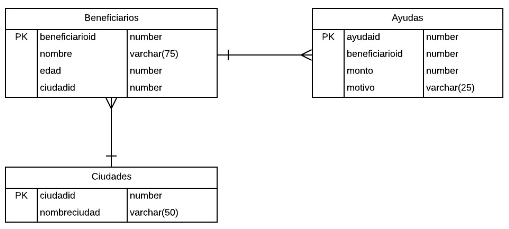

# awakelab-ensayo-beneficencia

## Problema

Una institución de beneficencia desea llevar registro de todos los movimientos en ayuda de sus clientes, esto con el objetivo de ordenar los destinos a los que se asocia una colaboración.

Para esto se ha diseñado el siguiente modelo de datos: 

A través del modelo anterior, se debe crear un portal web compuesto por dos secciones:
 - Listado de montos por ciudades: se pide desplegar una tabla que muestre el listado de ciudades, el tipo de ayuda y el monto total correspondiente a cada clasificación.
 - Formulario de creación de ayuda: debe crear un formulario que contenga un campo selector de cliente, un campo para el monto y un motivo. Al procesarlo se debe crear un nuevo registro en la tabla “Ayudas”. 

## Requerimientos

Debe crear un portal compuesto solo por una página vista.
 - El sistema debe ser construido utilizando el framework Spring MVC, conectándose a una base de datos Oracle 11g express.
 - Al abrir la página, se debe desplegar en la tabla superior el resumen de los registros existentes en la base de datos, de acuerdo con lo solicitado.
 - Una vez que se agregue una nueva ayuda, se debe actualizar el listado superior. 
 - Debe crear un servicio REST que retorne el listado de beneficiarios en formato JSON. Este servicio debe ser consumido desde el mismo sitio, y utilizado para cargar los datos del campo de selección del formulario. Puede usar una conexión directa a la base de datos sin Rest, pero no le permitirá tener el puntaje máximo asociado a este punto.
 - El campo ayudaid de la tabla Ayudas debe ser tratado como un valor autoincremental. No aplica lo mismo para las demás claves primarias.
 - La revisión del problema se realizará en base al modelo antes planteado; no se permite agregar, modificar o quitar campos del modelo. 
